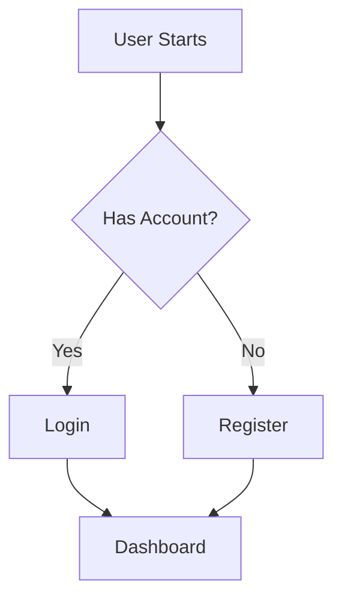

# 📊 Diagrams as Code (Mermaid.js)

Did you know you can make charts in GitHub just by writing text? No images required!
Copy these blocks into your Markdown files.

### 🔀 Flowchart

```mermaid
graph TD;
    A[User Starts] --> B{Has Account?};
    B -- Yes --> C[Login];
    B -- No --> D[Register];
    C --> E[Dashboard];
    D --> E;
```
