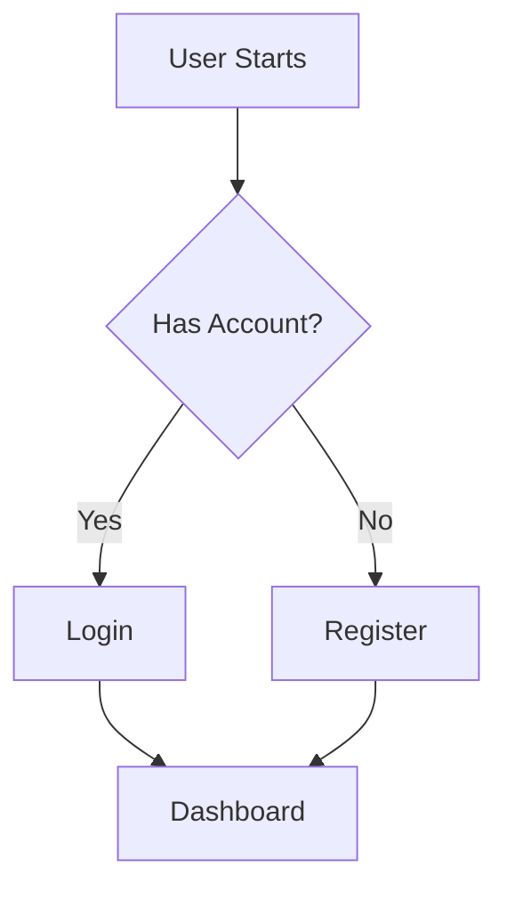
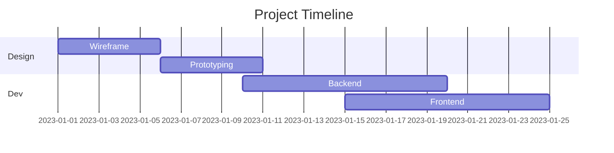
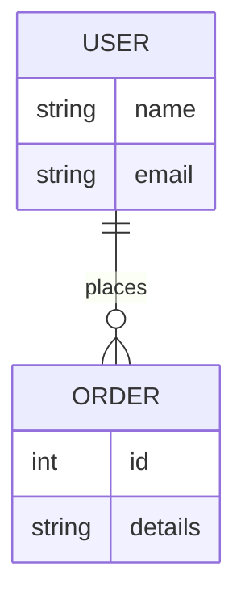

# 📊 Diagrams as Code (Mermaid.js)

Did you know you can make charts in GitHub just by writing text? No images required!
Copy these blocks into your Markdown files.

### 🔀 Flowchart

### ⏱️ Gantt Chart (Timeline)

### 💾 Database Schema (ER Diagram)

Many More Differnet Are Available Here :- https://github.com/mermaid-js/mermaid
In **Readme** You will Find All the Diagram You Want
